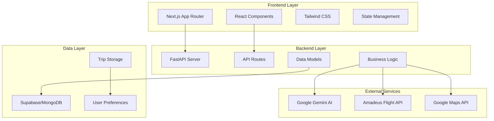

# Design Document: AI Travel Planner

## Overview

The AI Travel Planner is a modern full-stack web application that combines artificial intelligence with real-time travel data to generate personalized travel itineraries. The system uses a clean separation between frontend (Next.js with React) and backend (FastAPI with Python), connected through RESTful APIs. The core intelligence comes from Google Gemini AI, which processes user preferences to create comprehensive day-by-day travel plans including activities, transport options, and budget breakdowns.

The application follows modern web development patterns with server-side rendering for performance, client-side interactivity for user experience, and structured data flow between components. The architecture supports scalability through modular design and can accommodate future enhancements like user authentication, social features, and advanced AI capabilities.

## Architecture

### System Architecture



### Technology Stack Integration

**Frontend Architecture (Next.js App Router)**:
- **Server Components**: Default rendering for static content and initial data loading
- **Client Components**: Interactive elements like form inputs, state management, and user interactions
- **File-based Routing**: Organized route structure with layouts and nested routes
- **Streaming**: Progressive loading of AI-generated content for better user experience

**Backend Architecture (FastAPI)**:
- **Domain-driven Structure**: Organized by business domains (trips, transport, ai-planning)
- **Dependency Injection**: Clean separation of concerns with FastAPI's dependency system
- **Async Operations**: Non-blocking I/O for external API calls and database operations
- **Pydantic Models**: Type-safe data validation and serialization

## Components and Interfaces

### Frontend Components

**Page Components**:
- `app/page.tsx`: Home page with trip planning form
- `app/results/page.tsx`: Results display with itinerary and visualizations
- `app/layout.tsx`: Root layout with global styles and providers

**UI Components**:
- `components/TripForm.tsx`: Main form component with all input fields
- `components/BudgetSelector.tsx`: Budget category selection cards
- `components/TravelerTypeSelector.tsx`: Traveler type selection cards
- `components/ItineraryDisplay.tsx`: Day-wise itinerary presentation
- `components/TransportOptions.tsx`: Flight and local transport display
- `components/BudgetBreakdown.tsx`: Cost analysis and breakdown
- `components/MapView.tsx`: Interactive route visualization

**State Management**:
- React Context for global state (selected preferences, loading states)
- useState for local component state (form inputs, UI interactions)
- Custom hooks for API calls and data fetching

### Backend Components

**API Routes** (`/api/v1/`):
```python
# Trip Planning
POST /plan-trip
  - Input: TripRequest (destination, days, budget, travelers)
  - Output: TripItinerary (structured JSON with daily plans)

# Transport Services  
GET /flights
  - Input: FlightSearchParams (origin, destination, dates)
  - Output: FlightOptions (real-time flight data)

GET /local-transport
  - Input: TransportRequest (location, transport_type)
  - Output: TransportOptions (taxi, bus, metro estimates)
```

**Service Layer**:
- `services/ai_planner.py`: Gemini AI integration and prompt management
- `services/transport_service.py`: Amadeus API and transport data aggregation
- `services/trip_service.py`: Trip creation, storage, and retrieval
- `services/database_service.py`: Database operations and data persistence

**Data Models** (Pydantic):
```python
class TripRequest(BaseModel):
    destination: str
    days: int
    budget: BudgetCategory
    travelers: TravelerType

class DayPlan(BaseModel):
    day_number: int
    activities: List[Activity]
    transport: List[TransportOption]
    estimated_cost: float

class TripItinerary(BaseModel):
    trip_id: str
    destination: str
    total_days: int
    daily_plans: List[DayPlan]
    total_budget: float
```

### Interface Contracts

**Frontend-Backend Communication**:
- RESTful JSON APIs with consistent error handling
- TypeScript interfaces matching Pydantic models
- Standardized response format with data, status, and error fields

**External API Integration**:
- Gemini AI: Structured prompts with JSON response parsing
- Amadeus API: Flight search with real-time availability
- Google Maps API: Route optimization and local transport estimates

## Data Models

### Core Data Structures

**Trip Planning Models**:
```typescript
interface TripPreferences {
  destination: string;
  days: number;
  budget: 'cheap' | 'moderate' | 'luxury';
  travelerType: 'just-me' | 'couple' | 'family' | 'friends';
}

interface Activity {
  name: string;
  description: string;
  duration: number;
  cost: number;
  category: 'sightseeing' | 'dining' | 'entertainment' | 'cultural';
}

interface TransportOption {
  type: 'flight' | 'taxi' | 'bus' | 'metro' | 'walking';
  provider: string;
  cost: number;
  duration: number;
  route: string;
}
```

**Database Schema** (Supabase/MongoDB):
```sql
-- Trips table
trips (
  id: uuid PRIMARY KEY,
  user_id: uuid,
  destination: text,
  days: integer,
  budget_category: text,
  traveler_type: text,
  itinerary: jsonb,
  created_at: timestamp,
  updated_at: timestamp
)

-- User preferences table
user_preferences (
  user_id: uuid PRIMARY KEY,
  preferred_budget: text,
  preferred_traveler_type: text,
  favorite_destinations: text[],
  created_at: timestamp
)
```

### Data Flow Architecture

**Request Flow**:
1. User submits form → Frontend validation → API request
2. Backend receives request → Input validation → Business logic
3. AI service processes → External APIs called → Response aggregation
4. Database storage → Response formatting → Frontend update

**State Management Flow**:
- Form state: Local component state with validation
- Global state: Trip results, loading states, error handling
- Persistent state: Database storage for trip history and preferences

## Error Handling

### Frontend Error Handling

**Form Validation**:
- Real-time input validation with user-friendly error messages
- Required field validation before form submission
- Budget and traveler type selection enforcement

**API Error Handling**:
- Network error detection with retry mechanisms
- Loading states during API calls
- User-friendly error messages for different failure scenarios
- Graceful degradation when external services are unavailable

**UI Error States**:
```typescript
interface ErrorState {
  type: 'validation' | 'network' | 'server' | 'ai-generation';
  message: string;
  retryable: boolean;
}
```

### Backend Error Handling

**Input Validation**:
- Pydantic model validation with detailed error responses
- Custom validators for business logic constraints
- Sanitization of user inputs to prevent injection attacks

**External API Error Handling**:
- Timeout handling for AI and transport API calls
- Fallback mechanisms when external services fail
- Rate limiting and quota management for API usage

**Database Error Handling**:
- Connection pooling and retry logic for database operations
- Transaction management for data consistency
- Backup and recovery procedures for data persistence

**Error Response Format**:
```python
class ErrorResponse(BaseModel):
    error: bool = True
    message: str
    error_code: str
    details: Optional[Dict] = None
    retry_after: Optional[int] = None
```

## Testing Strategy

### Dual Testing Approach

The application will use both unit testing and property-based testing to ensure comprehensive coverage and correctness validation.

**Unit Testing Focus**:
- Specific examples demonstrating correct behavior
- Integration points between frontend and backend components
- Edge cases and error conditions
- API endpoint functionality with mock data

**Property-Based Testing Focus**:
- Universal properties that hold across all valid inputs
- AI response validation and consistency
- Data transformation and serialization correctness
- User input validation across various scenarios

### Testing Configuration

**Frontend Testing** (Jest + React Testing Library):
- Component rendering and interaction tests
- Form validation and state management tests
- API integration tests with mocked responses
- Accessibility and user experience tests

**Backend Testing** (pytest + FastAPI TestClient):
- API endpoint tests with various input combinations
- Database operation tests with test database
- External API integration tests with mock services
- Performance tests for AI generation and data processing

**Property-Based Testing** (Hypothesis for Python, fast-check for TypeScript):
- Minimum 100 iterations per property test
- Each test tagged with: **Feature: ai-travel-planner, Property {number}: {property_text}**
- Properties validate universal correctness across randomized inputs
- Integration with CI/CD pipeline for continuous validation

## Correctness Properties

*A property is a characteristic or behavior that should hold true across all valid executions of a system—essentially, a formal statement about what the system should do. Properties serve as the bridge between human-readable specifications and machine-verifiable correctness guarantees.*

### Converting EARS to Properties

Based on the prework analysis, the following properties have been identified as testable and provide unique validation value:

**Property 1: Form Input Validation**
*For any* trip planning form submission, if any required field (destination, days, budget, traveler type) is missing or invalid, the form validation should reject the submission and display appropriate error messages.
**Validates: Requirements 1.7**

**Property 2: Single Selection Enforcement**
*For any* form selection component (budget cards or traveler type cards), selecting one option should deselect all other options in that category, and the selected option should display visual feedback (black border).
**Validates: Requirements 1.4, 1.5, 1.6**

**Property 3: AI Response Structure Completeness**
*For any* valid trip planning request, the AI engine should return structured JSON containing day-by-day breakdown with activities, transport options, and cost estimates for each day.
**Validates: Requirements 2.5, 2.6**

**Property 4: Transport Options Appropriateness**
*For any* budget category and traveler type combination, the AI engine should generate transport options and activities that are appropriate for the specified budget level and group composition.
**Validates: Requirements 2.2, 2.3**

**Property 5: Transport Data Completeness**
*For any* transport request, the backend should return all available transport types (taxi, bus, metro) with consistent formatting and cost estimates, or provide reasonable mock data when external APIs are unavailable.
**Validates: Requirements 3.1, 3.2, 3.3, 3.4**

**Property 6: Data Persistence Round Trip**
*For any* completed trip planning session, storing the trip data and then retrieving it should produce equivalent trip information including all preferences, itinerary details, and cost breakdowns.
**Validates: Requirements 5.1, 5.2, 5.3**

**Property 7: API Response Consistency**
*For any* API endpoint response, the returned data should follow consistent JSON formatting with appropriate HTTP status codes, and errors should include descriptive messages with proper error codes.
**Validates: Requirements 6.4, 6.5, 6.6**

**Property 8: Complete Information Display**
*For any* generated itinerary, the frontend should display all essential information including day-wise activities, transport options with costs, and comprehensive budget breakdown without missing data.
**Validates: Requirements 4.1, 4.2, 4.3**

**Property 9: UI Responsiveness**
*For any* user interaction with form elements or API requests, the frontend should provide immediate visual feedback for interactions and display appropriate loading states during processing.
**Validates: Requirements 8.3, 8.4**

**Property 10: Error Message Display**
*For any* error condition (validation, network, server, or AI generation errors), the frontend should display user-friendly error messages that help users understand and resolve the issue.
**Validates: Requirements 8.5**